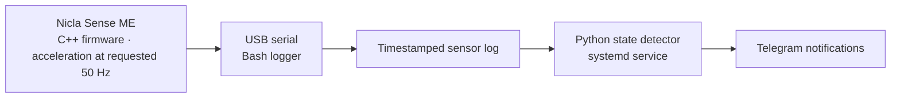

# Embedded Vibration Monitor

A vibration-based washing-machine activity monitor built with Arduino Nicla
Sense ME firmware and a Raspberry Pi Linux gateway. It records sensor readings,
detects sustained activity and inactivity, and sends Telegram notifications.

This project is a warm-up for more complex embedded systems and robotics
projects, combining sensor acquisition, USB communication, Linux services, and
measurement-based tuning. It uses just one capability of the Nicla Sense ME:
acceleration sensing to detect vibration. The board’s remaining capabilities
will be explored in future projects.
After calibrating the parameters of the working prototype using the first wash cycle,
the notifications matched the user's observed wash times with accuracy of around 30 seconds.

## Top-level requirement

Embedded systems development starts with top-level requirements. For this
project, the main requirement was:

> The system shall detect the start and stop of a washing machine with acceptable tolerance.

The acceptable timing tolerance was assessed through practical observation of
wash cycles; a numerical acceptance limit was not specified in advance.

## Architecture



The logger is the sole serial reader. The detector follows the log independently,
so recording, detection, and notification delivery have separate responsibilities.

## Detection

Firmware computes the root-mean-square magnitude of differences between
successive acceleration vectors over approximately one second. Scores are raw
sensor counts, not acceleration in physical units. The vibration threshold of 7
has no physical meaning and selected only for the devices and conditions used in this project.

| Setting | Current value |
|---|---|
| Vibration threshold | 7 raw RMS-delta counts |
| Start confirmation | At least 60% vibration in a complete 20-second window |
| Stop confirmation | 120 continuous seconds below threshold |
| Maximum sample gap | 3 seconds |
| Minimum valid sample-pair rate | 25 per second |

Missing or invalid data resets accumulated evidence to `UNKNOWN`; it is not
interpreted as inactivity. The last confirmed state is stored separately to
reduce duplicate notifications after recovery. A stop message indicates that
vibration stopped, not proof of appliance program completion.

## Validation

The first recording was used for tuning. A subsequent wash provided a new-cycle
check: offline replay detected activity at **22:16:44** and inactivity at
**22:56:52**, matching Telegram messages at 22:16 and 22:56. The user confirmed
that this interval roughly matched the actual wash. There were no intervening
stop transitions or additional notification intents in that replay.

Two brief sensor restarts occurred during the second wash. The detector recovered;
their cause remains unresolved. This is a working prototype, not a quantified
accuracy or long-term reliability claim. See [validation](docs/VALIDATION.md).

## Repository guide

- [`nicla-firmware/`](nicla-firmware/): C++ vibration-sensing firmware in `03_usb_vibration`.
- [`linux/`](linux/): logger, detector, Telegram helper, service templates, and configuration.
- [`tests/`](tests/): Python detector/notification tests and C++ vibration calculation tests.
- [Setup guide](linux/WASHER_SETUP.md): firmware build, Pi installation, and operation.
- [Protocol and design](docs/DESIGN.md): message fields, state behavior, and limitations.
- [Validation](docs/VALIDATION.md): observations from both wash cycles.
- [Live sensor check](docs/SENSOR_CHECK.md): view readings and check stillness, movement, and continuity.

## Try without hardware

Use the [synthetic example and offline replay](examples/README.md) to observe
idle → active → idle transitions without a Nicla, Pi, or Telegram connection.
The example is generated data, not a real wash recording.

## Run the tests

Python 3 and its standard library are sufficient. From the repository root:

```bash
python3 -m unittest discover -s tests -p 'test_*.py' -v
```

Tests use their own controlled settings, independently of `washer-config.json`,
so deployment tuning does not change the test scenarios.

Tests cover timing boundaries, intermittent motion, invalid samples, sensor
restarts, parsing, and notification selection. Telegram calls are mocked.
Hardware, systemd, and network delivery are not exercised by these tests.

### Firmware calculation tests

The firmware and host tests share `VibrationAccumulator.h`, so these tests
exercise the actual vibration calculation used by the Nicla sketch. A C++11
compiler (Clang or GCC) is required; no Arduino board or sensor library is needed.
From the repository root:

```bash
mkdir -p build/tests
c++ -std=c++11 -Wall -Wextra -pedantic tests/test_vibration.cpp -o build/tests/test_vibration
./build/tests/test_vibration
```

Checks cover empty/first samples, constant acceleration, known three-axis RMS
values, pair counting, large signed differences, and clearing a summary window
while retaining the preceding sample. These do not exercise the sensor library,
USB transport, or hardware timing; use the [live sensor check](docs/SENSOR_CHECK.md)
for those observations.

## Hardware and dependencies

- Arduino Nicla Sense ME and USB data cable
- Raspberry Pi 3 Model B, running Raspberry Pi OS 64-bit
- Arduino Mbed OS Nicla board package 4.6.0 and Arduino_BHY2 1.0.8
- Python 3, Bash, GNU coreutils, systemd; internet access for Telegram

Downloaded libraries, toolchains, build products, credentials, raw household
recordings, and personal session notes are excluded from version control.

## License

Copyright (c) 2026 Soheil Samadi.

Original code, documentation, configuration, and synthetic example data in this
repository are licensed under the **GNU Affero General Public License v3.0 only**
(`AGPL-3.0-only`). See [LICENSE](LICENSE) for the full terms.

Third-party libraries, board support packages, and tools retain their own licenses;
they are not relicensed by this repository. See
[third-party notices](THIRD_PARTY_NOTICES.md) for the dependencies reviewed and
the limits of that review. Downloaded dependencies and compiled firmware are not
included in the repository.
